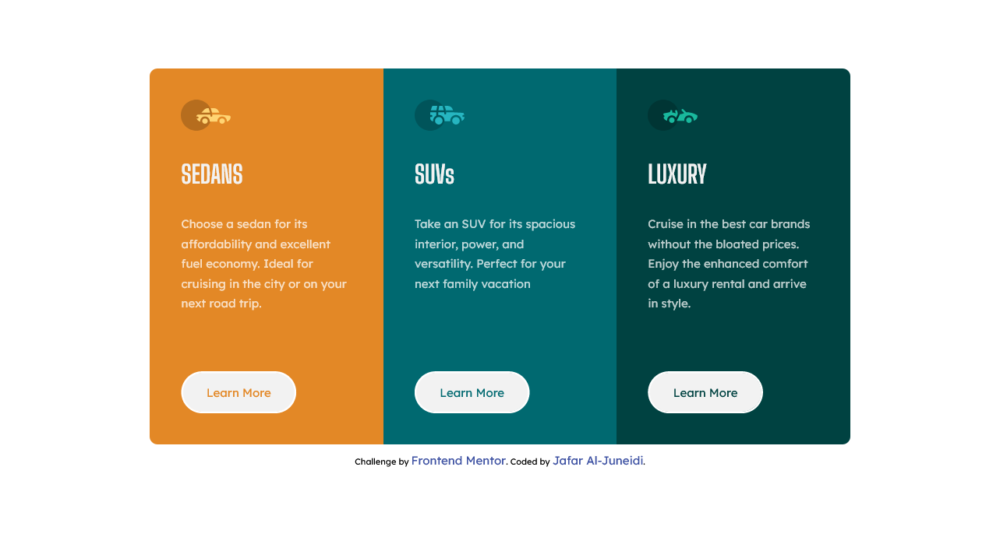
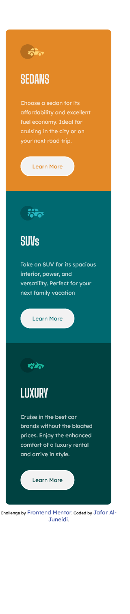

# Frontend Mentor - 3-column preview card component solution

This is a solution to the [3-column preview card component challenge on Frontend Mentor](https://www.frontendmentor.io/challenges/3column-preview-card-component-pH92eAR2-). Frontend Mentor challenges help you improve your coding skills by building realistic projects.

## Table of contents

-   [Overview](#overview)
    -   [The challenge](#the-challenge)
    -   [Screenshot](#screenshot)
    -   [Links](#links)
-   [My process](#my-process)
    -   [Built with](#built-with)
    -   [What I learned](#what-i-learned)
    -   [Continued development](#continued-development)
    -   [Useful resources](#useful-resources)
-   [Author](#author)
-   [Acknowledgments](#acknowledgments)

## Overview

### The challenge

Users should be able to:

-   View the optimal layout depending on their device's screen size
-   See hover states for interactive elements

### Screenshot




### Links
-   [live site](https://friendly-cori-7d3f38.netlify.app/)

## My process

### Built with

-   Semantic HTML5 markup
-   CSS custom properties
-   Flexbox

### What I learned

Reinforced CSS flexbox concepts, in addition to cleaner CSS code and comments!

To see how you can add code snippets, see below:

Cleaner HTML and CSS classes

```html
<div class="flex card sedan">
    <div>
        
        <h1>SEDANS</h1>
        <p>
            Choose a sedan for its affordability and excellent fuel economy. Ideal for cruising in the city or on your
            next road trip.
        </p>
    </div>
    <a href="#">Learn More</a>
</div>
```

Root variables for easier editing and reuse.

```css
:root {
    --first-card: hsl(31, 77%, 52%);
    --second-card: hsl(184, 100%, 22%);
    --third-card: hsl(179, 100%, 13%);

    --transparent-white: hsla(0, 0%, 100%, 0.75); /* paragraphs*/
    --very-light-gray: hsl(0, 0%, 95%); /* background, headings, buttons */

    --primary-font: 'Big Shoulders Display', cursive;
    --secondary-font: 'Lexend Deca', sans-serif;
}
```

### Continued development

In terms of responsivness, I want the design to smoothly flow while resizing the screen, in all screen sizes.
Didn't work quiet well with this one.

### Useful resources

-   [resource 1](https://css-tricks.com/snippets/css/a-guide-to-flexbox/) - This helped me with CSS flexbox. I really liked this cite and will use it going forward.

## Author

-   Frontend Mentor - [@JafarJuneidi](https://www.frontendmentor.io/profile/JafarJuneidi)

## Acknowledgments

Good job me. now to the next one
